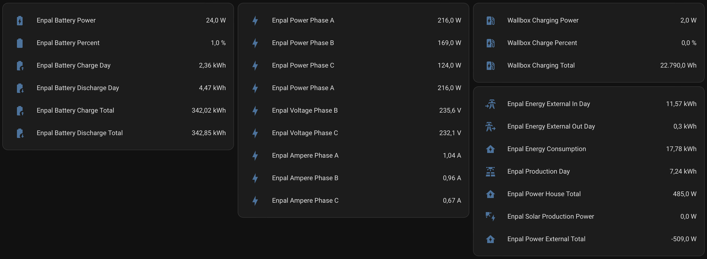
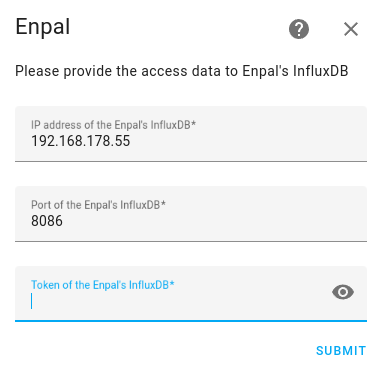

#  Enpal - Home Assistant integration (WiP)

## Disclaimer

This integration is created with acknowledgement and limited support from Enpal GmbH, but __it's not official software from Enpal__. 
It's a custom integration created entirely by me (gickowtf) and Skipperro, and thus Enapl GmbH is not responsible for any damage/issues caused by this integration, nor it offers any end-user support for it.

It is still a work in progress and is not guaranteed to work 100% or even work at all. 

## Features

- **Inverter measurements**:
  - Solar Production Power
  - Power House Total
  - Power External Total'
  - Energy Consumption
  - Production Day
  - Inverter temperature.
  - Energy External Out Day
  - Energy External In Day
  - Voltage, Current, Power Phase A, B and C
- **Battery estimation**:
  - Battery Power
  - Battery Percent
  - Battery Charge Day
  - Battery Discharge Day
  - Battery Charge Total
  - Battery Disharge Total
- **WallBox**:
  - Wallbox Charge Percent
  - Wallbox Charging Power
  - Wallbox Charging Total

## Installation

1. Install this integration with HACS (adding repository required), or copy the contents of this
repository into the `custom_components/enpal` directory.
2. Restart Home Assistant.
3. Start the configuration flow:
   - 
   - Or: Go to `Configuration` -> `Integrations` and click the `+ Add Integration`. Select `Enpal` from the list.
   - If the integration is not found try to refresh the HA page without using cache (Ctrl+F5).
4. Input the IP, Port and access token for access InfluxDB server of your Enpal solar installation.

## How to get access token?

Look at the Solar Rel Web Interface on your Local Network under Config!

or you can contact Enpal support. 

## Credits
 
- Skipperro: Creating the integration for Home Assistant.
- gickowtf: Creating the integrartion for Home Assistant with the new Enpal Solar Rel Web Interface
